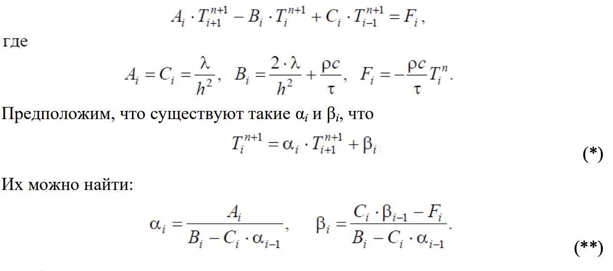

# Отчёт по лабораторной работе

## Метод конечных разностей для уравнения теплопроводности

### 1. Цель работы

Реализовать моделирование изменения температуры в пластине на основе одномерного уравнения теплопроводности с использованием метода конечных разностей.

Выполнить моделирование с различными шагами по времени и по пространству.  
Заполнить таблицу значений температуры в центральной точке пластины после 30 секунд модельного времени.

### 2. Неявная схема вычислений уравнение теплопроводности

Решаем ее методом прогонки.  

Метод прогонки заключается в том, что сначала
выполняется так называемая прямая прогонка: α1 и β1 находим из левого
граничного условия, затем используем рекуррентные выражения (**) для
вычисления остальных αi и βi. Значения Ti
n+1 вычисляем в обратном порядке
(обратная прогонка) по формуле (*), стартуя от правого граничного условия:
от точки xN до точки x2. В результате за один цикл прямой и обратной прогонки
получаем значения температуры в каждой точке на новом шаге по времени.

### 3. Результаты моделирования

- Материал : **платина**
- Плотность материала : **21450 кг/м3**
- Удельная теплоемкость : **132.6 Дж/(кг⋅ºC)**
- Коэффициент теплопроводности : **69.7 Вт/(м⋅ºC)**
- Толщина пластины : **10 см**
- Температура внутри : **25ºC**
- Температура снаружи : **-30ºC**

**Полученные данные:**

**Таблица результатов моделирования**

| Шаг по времени, с \ Шаг по пространству, м | 0.1 | 0.01 | 0.001 | 0.0001 |
|-------------------------------------------|-----|------|-------|--------|
| 0.1 | -30.0000 | 3.7938 | 3.8891 | 3.8900 |
| 0.01 | -30.0000 | 3.7704 | 3.8646 | 3.8655 |
| 0.001 | -30.0000 | 3.7681 | 3.8622 | 3.8630 |
| 0.0001 | -30.0000 | 3.7678 | 3.8619 | 3.8628 |

**Таблица времени моделирования**

| Шаг по времени, с \ Шаг по пространству, м | 0.1 | 0.01 | 0.001 | 0.0001 |
|-------------------------------------------|-----|------|-------|--------|
| 0.1 | 0.0003 | 0.0008 | 0.0043 | 0.0260 |
| 0.01 | 0.0012 | 0.0030 | 0.0188 | 0.1617 |
| 0.001 | 0.0087 | 0.0254 | 0.1712 | 1.6132 |
| 0.0001 | 0.0876 | 0.2486 | 1.7026 | 16.0422 |

### 4. Выводы

В ходе проделанной работы можно выделить несколько выводов:

- Метод прогонки обеспечивает достаточно устойчивое решение при разных шагах по времени. В целом можно утверждать, что h = 0.001 является достаточным для данной задачи.
- В данном методе есть явная зависимость точности вычисления от шага по пространству(шага по сетке). Если мы берем маленький шаг h = 0.1, то значение температуры = -30, что является грубой неточностью. Однако при увеличении шага оно устанавливается в диапазоне -3.86 в зависимости от шага по времени. Дальнейшее уменьшение шага по пространству приводит к незначительному изменению результату.