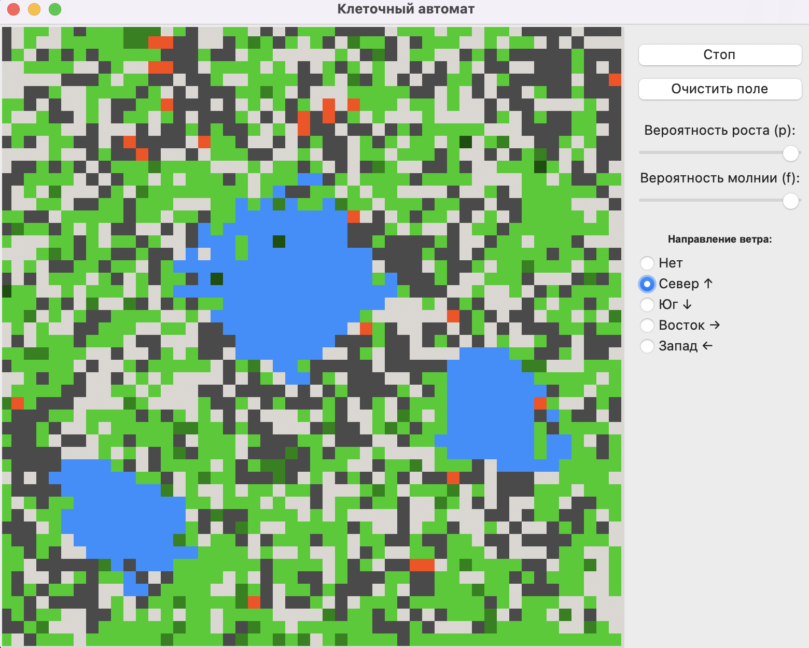

# Отчёт по лабораторной работе

## Клеточные автоматы. Лесные пожары

### 1. Цель работы

Разработать программную модель симуляции возникновения и распространения лесных пожаров на базе двумерного клеточного автомата. Реализовать базовые правила поведения системы, добавить не менее трех дополнительных правил для повышения физической достоверности модели, а также разработать графический интерфейс пользователя (GUI) для управления параметрами в реальном времени.

---

### 2. Состояния системы

Модель реализована на сетке $N \times N$. Каждая клетка может находиться в одном из следующих состояний:

- EMPTY (0): Пустая земля, пригодная для роста.
- ASH (1): Пепелище.
- TREE_YOUNG (2), MEDIUM (3), OLD (4): Стадии жизни дерева.
- BURNING (5): Горящая клетка.
- WATER (6): Несгораемая преграда.

---

### 3. Основные правила

#### 1. Распространение огня

Вероятность возгорания дерева $P_{ignite}$ зависит от базовой горючести стадии его жизни и вектора ветра.

Формула:$$P_{ignite} = P_{age} + \Delta P_{wind}$$где $P_{age}$ — базовая вероятность возгорания для разных деревьев, а $\Delta P_{wind}$ — модификатор, зависящий от направления ветра $\vec{W}$ и вектора к горящему соседу $\vec{D}$.

Фрагмент кода:
```python
base_chance = 0.2 if state == TREE_YOUNG else (0.5 if state == TREE_MEDIUM else 0.8)

if (wy == -dy and wy != 0) or (wx == -dx and wx != 0):
    base_chance += 0.5
elif (wy == dy and wy != 0) or (wx == dx and wx != 0):
    base_chance -= 0.15
```

#### 2. Самовозгорание

Каждое дерево в каждом кадре имеет независимый шанс загореться без внешнего воздействия.

Формула: 

$Random(0, 1) < f$, где $f$ — вероятность удара молнии, задаваемая пользователем в GUI.

Фрагмент кода:
```python
if state in [TREE_YOUNG, TREE_MEDIUM, TREE_OLD]:
    if random.random() < f_lightning:
        new_grid[y, x] = BURNING
```

#### 3. Восстановление леса

В пустой клетке с вероятностью $p$ вырастает новое дерево.

Формула: 

$Random(0, 1) < p$, где $p$ — вероятность роста дерева, задаваемая пользователем в GUI.

Фрагмент кода:
```python
if state == EMPTY:
    if random.random() < p_grow:
        new_grid[y, x] = TREE_YOUNG
```

---

### 4. Дополнительные правила

#### 1. Старение

Каждое дерево с заданной вероятностью может эволюционировать.

Формула: 

$TREE\_YOUNG \xrightarrow{p_{age}} TREE\_MEDIUM \xrightarrow{p_{age}} TREE\_OLD$.

Фрагмент кода:
```python
if state in [TREE_YOUNG, TREE_MEDIUM, TREE_OLD]:
    if state == TREE_YOUNG and random.random() < self.prob_age:
        new_grid[y, x] = TREE_MEDIUM
    elif state == TREE_MEDIUM and random.random() < self.prob_age:
        new_grid[y, x] = TREE_OLD
```

#### 2. Сгорание

Сгоревшее дерево превращается в пепел. В совю очередь пепел с заданной вероятностью превращается в пустое поле.

Формула: 

$BURNING \to ASH$

$ASH \xrightarrow{p_{clear}} EMPTY$

Фрагмент кода:
```python
if state == BURNING:
    new_grid[y, x] = ASH

if state == ASH:
    if random.random() < self.prob_ash_clear:
        new_grid[y, x] = EMPTY
```

#### 3. Интерактивные барьеры (Вода)

Реализована возможность динамического изменения ландшафта. С помощью мыши пользователь может рисовать водные преграды, которые имеют статус WATER и обладают нулевой горючестью, блокируя фронт огня.

---

### 5. Результаты моделирования



---

### 6. Выводы

В ходе работы была реализована устойчивая модель клеточного автомата, демонстрирующая сложные биологические и физические процессы. Введение дополнительных факторов (ветер, возраст дерева, пепел) позволило добиться реалистичного поведения пожара: возникновение "огненных языков", затухание в молодняке и естественные циклы восстановления леса после катастрофы.