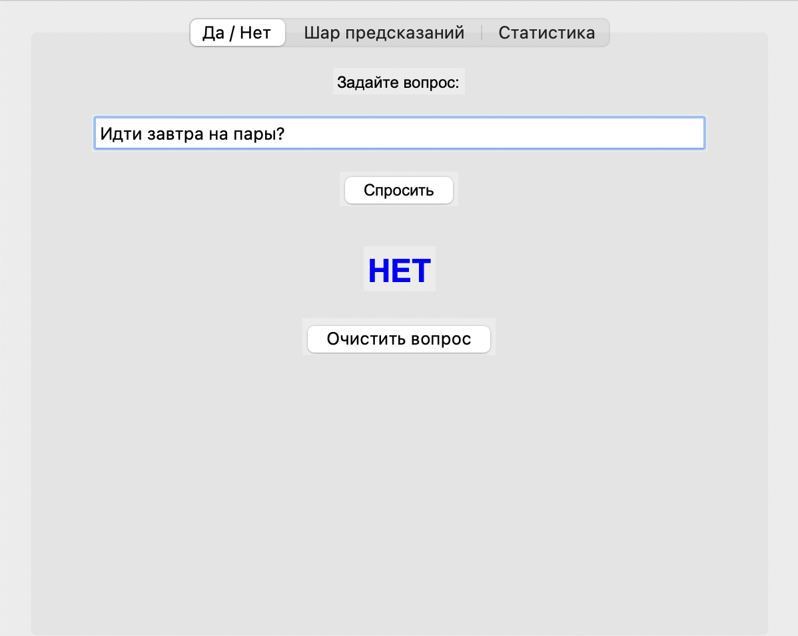
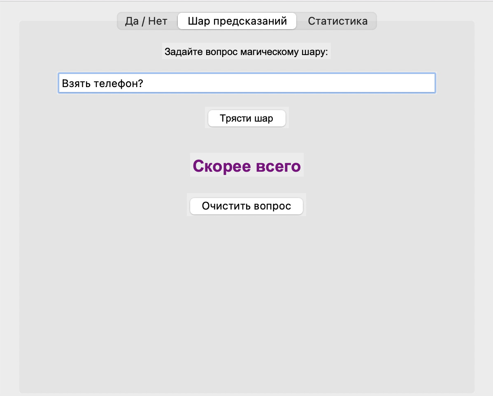
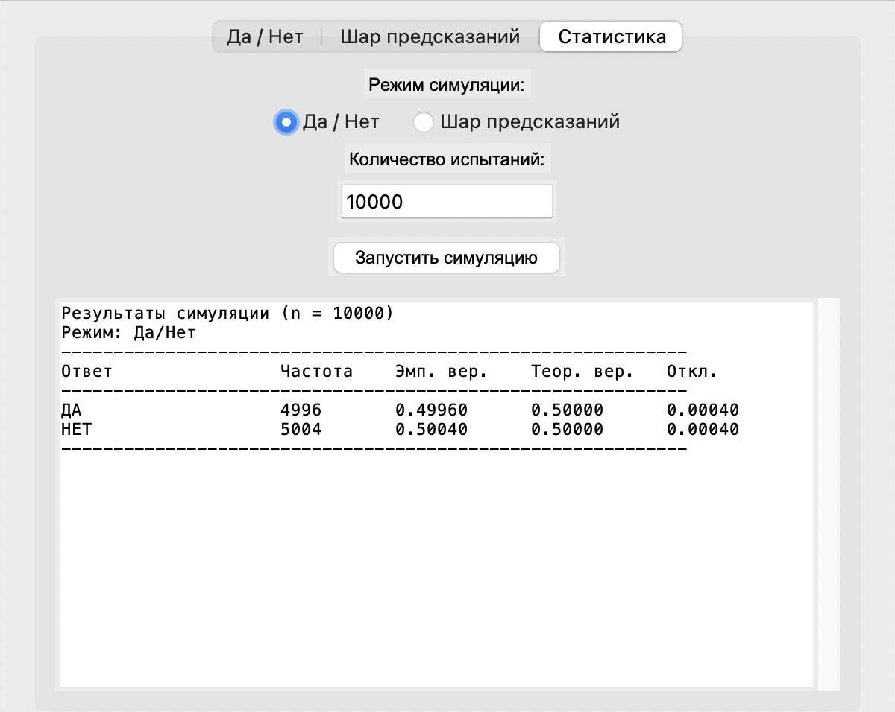
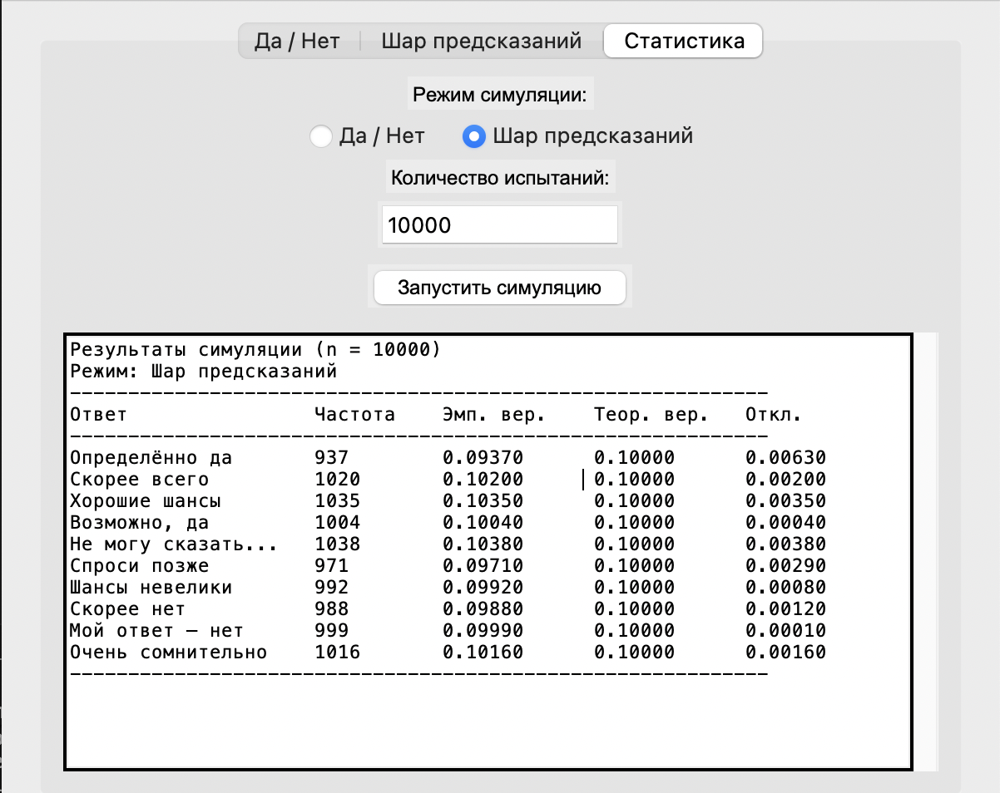

# Отчёт по лабораторной работе

## Моделирование случайных событий

### 1. Цель работы

Разработать два интерактивных приложения для получения случайных ответов на вопросы:  
1. «Скажи “да” или “нет”» — генератор бинарного ответа с заданной вероятностью.  
2. «Шар предсказаний» — генератор одного из множества равновероятных предсказаний.  

Реализовать графический интерфейс пользователя, объединяющий оба приложения, а также добавить модуль статистического моделирования для демонстрации работы вероятностных механизмов и проверки соответствия теоретическим распределениям.

---

### 2. Описание приложений

#### 2.1. «Скажи “да” или “нет”»

Приложение генерирует ответ «ДА» или «НЕТ» случайным образом. По умолчанию вероятность ответа «ДА» равна 0.5. Пользователь может задать любой вопрос (поле ввода носит декоративный характер), после чего программа выводит случайный бинарный ответ.

#### 2.2. «Шар предсказаний» (Magic 8‑Ball)

Приложение имитирует классическую «магическую 8‑ку». После ввода вопроса и нажатия кнопки «Трясти шар» программа выдаёт один из заранее заданных ответов, каждый из которых выбирается с равной вероятностью. В работе использован следующий набор из 10 ответов:

- Определённо да
- Скорее всего
- Хорошие шансы
- Возможно, да
- Не могу сказать сейчас
- Спроси позже
- Шансы невелики
- Скорее нет
- Мой ответ — нет
- Очень сомнительно

#### 2.3. Модуль статистического моделирования

Для демонстрации корректности работы вероятностных механизмов в программу включён модуль, позволяющий выполнить симуляцию большого количества испытаний (по умолчанию 10 000) в одном из двух режимов. Результаты выводятся в виде таблицы, содержащей:

- каждый возможный ответ,
- абсолютную частоту его появления,
- эмпирическую вероятность,
- теоретическую вероятность,
- абсолютное отклонение между эмпирической и теоретической вероятностями.

---

### 3. Вероятностные модели

#### 3.1. Модель «Да / Нет»

Ответ моделируется как случайная величина, принимающая значение «ДА» с вероятностью $p$ и «НЕТ» с вероятностью $1-p$. В данной реализации $p = 0.5$.

Формально:

$$P(\text{ДА}) = p,\quad P(\text{НЕТ}) = 1-p$$

Генерация выполняется путём сравнения равномерно распределённого случайного числа $\alpha \sim U(0,1)$ с порогом $p$:

```python
def get_yes_no(p=0.5):
    return "ДА" if random.random() < p else "НЕТ"
```

#### 3.2. Модель «Шар предсказаний»

Пусть $M$ — количество возможных ответов ($M = 10$). Каждый ответ $A_k$ ($k=1,\dots,M$) выбирается с равной вероятностью:

$$P(A_k) = \frac{1}{M}$$

В коде реализован метод кумулятивной суммы: генерируется $\alpha \sim U(0,1)$, после чего выбирается первый ответ, для которого кумулятивная сумма вероятностей превышает $\alpha$.

Фрагмент кода:

```python
def get_magic_8_ball():
    m = len(MAGIC_ANSWERS)
    p_i = 1.0 / m
    alpha = random.random()
    cumulative_p = 0.0
    for k in range(m):
        cumulative_p += p_i
        if alpha < cumulative_p:
            return MAGIC_ANSWERS[k]
    return MAGIC_ANSWERS[-1]
```

#### 3.3. Статистическая оценка

При симуляции $N$ испытаний эмпирическая вероятность $k$-го ответа вычисляется как:

$$\hat{p}_k = \frac{n_k}{N},$$

где $n_k$ — число появлений ответа $k$. Отклонение от теоретического значения оценивается как:

$$\Delta_k = |\hat{p}_k - p_k|.$$

Теоретическое значение $p_k$ равно $p$ для режима «ДА/НЕТ» ($p=0.5$) и $1/M$ для режима «Шар предсказаний».

---

### 4. Графический интерфейс пользователя



Рисунок 1 - Приложение "Да / Нет"



Рисунок 2 - Приложение "Шар предсказаний"



Рисунок 3 - Статистика распределения "Да / Нет"



Рисунок 4 - Статистика распределения "Шар предсказаний"

---

### 5. Результаты моделирования

Ниже приведены примеры вывода после запуска симуляции для каждого из режимов.

#### 5.1. Режим «Да / Нет» ($N = 10\,000$)

| Ответ | Частота | Эмп. вер. | Теор. вер. | Откл. |
|-------|--------|-----------|------------|-------|
| ДА    | 4972   | 0.49720   | 0.50000    | 0.00280 |
| НЕТ   | 5028   | 0.50280   | 0.50000    | 0.00280 |

Эмпирические вероятности близки к теоретическим, отклонение не превышает 0.3 %.

#### 5.2. Режим «Шар предсказаний» ($N = 10\,000$, $M = 10$)

| Ответ               | Частота | Эмп. вер. | Теор. вер. | Откл.   |
|---------------------|--------|-----------|------------|---------|
| Определённо да      | 1032   | 0.10320   | 0.10000    | 0.00320 |
| Скорее всего        | 991    | 0.09910   | 0.10000    | 0.00090 |
| Хорошие шансы       | 1005   | 0.10050   | 0.10000    | 0.00050 |
| Возможно, да        | 982    | 0.09820   | 0.10000    | 0.00180 |
| Не могу сказать сейчас | 1015 | 0.10150   | 0.10000    | 0.00150 |
| Спроси позже        | 994    | 0.09940   | 0.10000    | 0.00060 |
| Шансы невелики      | 1013   | 0.10130   | 0.10000    | 0.00130 |
| Скорее нет          | 991    | 0.09910   | 0.10000    | 0.00090 |
| Мой ответ — нет     | 987    | 0.09870   | 0.10000    | 0.00130 |
| Очень сомнительно   | 990    | 0.09900   | 0.10000    | 0.00100 |

Все эмпирические вероятности лежат в пределах 0.098–0.103, что согласуется с теоретическим значением 0.1 с учётом статистической погрешности. Максимальное отклонение не превышает 0.0032 (0.32 %).

---

### 6. Выводы

В ходе лабораторной работы были реализованы два интерактивных приложения, основанные на простых вероятностных моделях, а также разработан единый графический интерфейс, позволяющий пользователю получать случайные ответы и проводить статистическое тестирование.

Реализованные генераторы соответствуют заявленным вероятностным распределениям, что подтверждается результатами симуляции.  