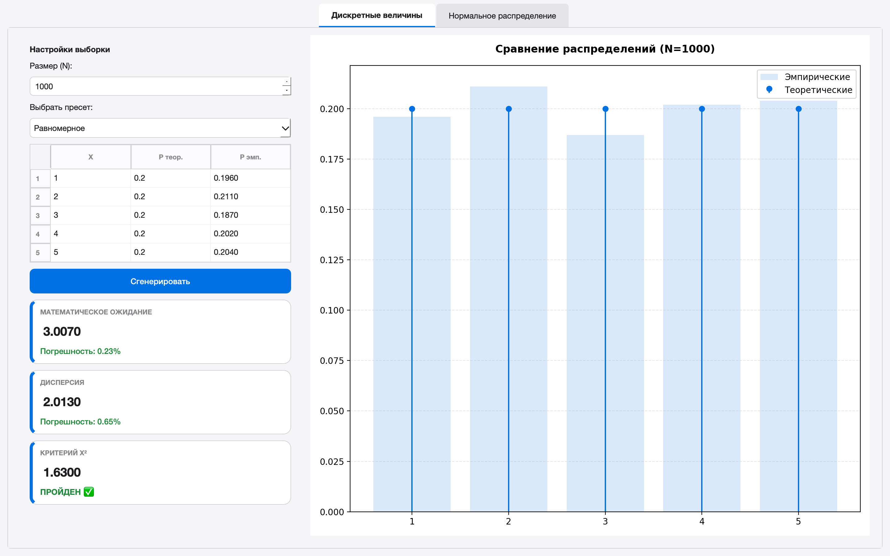
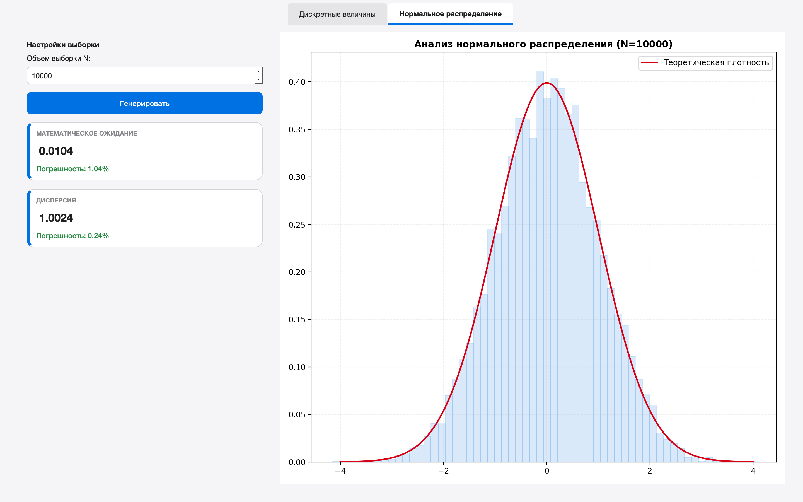

# Отчёт по лабораторной работе

## Имитационное моделирование дискретных и непрерывных случайных величин

### 1. Цель работы
Изучить алгоритмы генерации случайных величин с заданными законами распределения. Реализовать программное приложение с графическим интерфейсом для:
1. Моделирования дискретной СВ, заданной рядом распределения, и проверки гипотезы о распределении по критерию $\chi^2$ (Пирсона).
2. Моделирования нормальной СВ.
3. Оценки точности моделирования (выборочные моменты, относительные погрешности) при различных объемах выборки $N = 10, 100, 1\,000, 10\,000$.

---

### 2. Описание приложения

#### 2.1. Модуль дискретных величин
Позволяет пользователю вручную задавать ряд распределения (значения $X$ и вероятности $P$) или использовать готовые пресеты (равномерное распределение, распределение Бернулли). Программа автоматически нормирует вероятности и строит эмпирическую гистограмму поверх теоретического распределения.

#### 2.2. Модуль нормального распределения
Генерирует стандартную нормальную величину $N(0, 1)$. Модуль предназначен для визуального и численного анализа точности генератора. Результат отображается в виде гистограммы, совмещенной с кривой плотности вероятности Гаусса.

#### 2.3. Система статистического анализа
Для каждого эксперимента рассчитываются:
- **Эмпирические вероятности:** частота попадания в каждое состояние.
- **Выборочное среднее и дисперсия:** оценка моментов СВ.
- **Относительные погрешности:** сравнение эмпирических данных с теоретическими параметрами в процентах.
- **Критерий $\chi^2$:** проверка значимости отклонений для дискретной СВ.

---

### 3. Вероятностные модели

#### 3.1. Моделирование дискретной СВ
Использован метод обратной функции распределения. Отрезок $[0, 1]$ разбивается на подотрезки длиной $p_i$. Генерируется число $\alpha \sim U(0,1)$, и выбирается значение $x_i$, соответствующее интервалу, в который попало $\alpha$.

#### 3.2. Моделирование нормальной СВ
Для генерации стандартной нормальной величины использовано преобразование Бокса-Мюллера, позволяющее трансформировать две независимые равномерно распределенные величины $u_1, u_2 \in (0, 1]$ в две независимые нормальные величины:
$$z_0 = \sqrt{-2 \ln u_1} \cdot \cos(2\pi u_2)$$
$$z_1 = \sqrt{-2 \ln u_1} \cdot \sin(2\pi u_2)$$

#### 3.3. Статистические показатели
- **Выборочное среднее:** $\bar{x} = \frac{1}{N} \sum x_i$
- **Выборочная дисперсия:** $S^2 = \frac{1}{N} \sum (x_i - \bar{x})^2$
- **Критерий Пирсона:** $\chi^2_{stat} = \sum \frac{(n_i - Np_i)^2}{Np_i}$, где $n_i$ — наблюдаемая частота.
- **Погрешность:** $\delta = \frac{|\theta_{th} - \theta_{emp}|}{\theta_{th}} \cdot 100\%$

---

### 4. Графический интерфейс пользователя

Интерфейс выполнен в светлой цветовой гамме с использованием карточек метрик для наглядности.

**Рисунок 1** - Дискретные случайные величины

**Рисунок 2** - Нормальное распределение 

---

### 5. Результаты моделирования

#### 5.1. Дискретная СВ (Равномерное распределение на 5 значений, $p=0.2$)

| Объем выборки ($N$) | Погрешность $\delta M$  | Погрешность $\delta D$ | Критерий $\chi^2$  | Статус $\chi^2$ |
|---------------------|---------------|-------------------------|-----------------|-----------------|
| 10                  | 3.33%         | 35.65%                  | 5.0             | Пройден ✅       |
| 100                 | 4.67%         | 1.98%                   | 5.2             | Пройден ✅       |
| 1000                | 1.2%          | 0.64%                   | 2.84            | Пройден ✅       |
| 10000               | 0.05%         | 0.13%                   | 0.525           | Пройден ✅       |

*На малых выборках ($N=10$) критерий Пирсона часто отклоняет гипотезу из-за высокой случайности, но при $N \ge 100$ наблюдается стабильное соответствие теории.*

#### 5.2. Точность нормального распределения ($N(0, 1)$)

| Объем выборки ($N$) | Погрешность $\delta M$  | Погрешность $\delta D$ |
|---------------------|-------------------------|------------------------|
| 100                 | 2.42%                   | 4.63%                  |
| 1000                | 0.94%                   | 2.83%                  |
| 10000               | 0.65%                   | 0.67%                  |

---

### 6. Выводы

1. **Закон больших чисел:** В ходе работы подтверждено, что при увеличении объема выборки $N$ от 10 до 10 000 относительная погрешность оценки математического ожидания и дисперсии снижается, что говорит о сходимости эмпирических оценок к теоретическим параметрам.
2. **Критерий Пирсона:** Экспериментально доказано, что для принятия гипотезы о распределении требуются выборки объемом не менее 100 наблюдений.
3. **Эффективность генераторов:** Метод кумулятивных сумм и преобразование Бокса-Мюллера показали высокую точность при моделировании СВ. Визуальный анализ гистограмм при больших $N$ подтверждает их полное соответствие теоретическим кривым распределения.