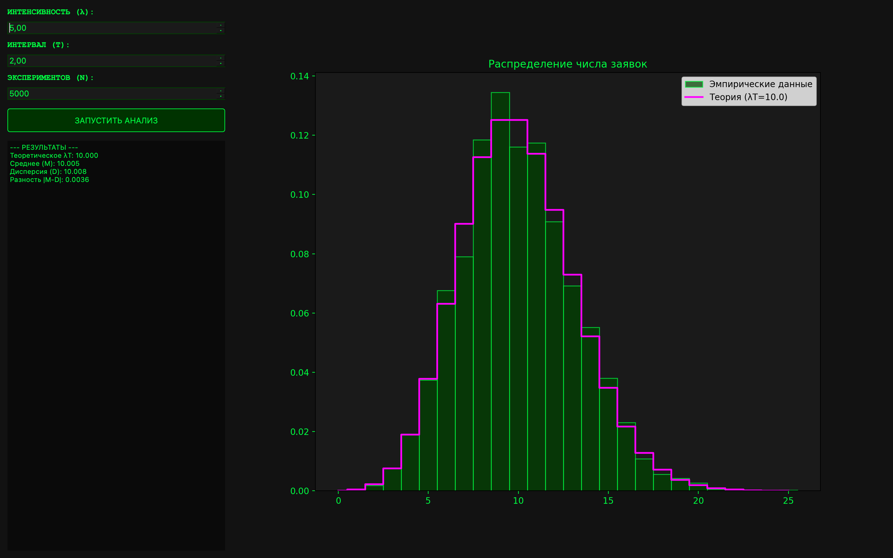

# Отчёт по лабораторной работе

## Пуассоновский поток. События на сервере

### 1. Цель работы

Изучить свойства простейшего (пуассоновского) потока событий. Реализовать программное приложение для имитационного моделирования поступления заявок на сервер с графическим интерфейсом для:

1. Моделирования случайных интервалов времени между событиями на основе экспоненциального распределения.
2. Подсчета количества событий, попавших в заданный интервал наблюдения $T$.
3. Построения эмпирического распределения и его сопоставления с теоретической функцией вероятности Пуассона.
4. Статистического анализа и проверки их соответствия теоретическим свойствам потока.

---

### 2. Описание приложения

#### 2.1. Модуль симуляции

Для генерации событий используется метод имитации временных интервалов. Время между последовательными заявками распределено по экспоненциальному закону. Программа суммирует эти интервалы до тех пор, пока их сумма не превысит заданный предел $T$, подсчитывая количество «уложившихся» событий для каждого из $N$ экспериментов.

#### 2.2. Система визуализации и аналитики

Интерфейс реализован на базе **PyQt6** с интеграцией **Matplotlib**. Он включает:

* **Конфигуратор параметров:** настройка интенсивности $\lambda$ (запр/сек), интервала $T$ и количества испытаний $N$.
* **Графики:** отображает гистограмму частот и ступенчатый график вероятности.
* **Статистика:** выводит рассчитанные значения среднего ($M$), дисперсии ($D$) и их отношение, что позволяет судить о качестве модели.

---

### 3. Математическая модель

#### 3.1. Генерация случайных величин

Для моделирования времени между событиями $\Delta t$ используется метод обратной функции:

$$\Delta t = \frac{-\ln(1 - U)}{\lambda}$$

где $U$ — случайная величина, равномерно распределенная на интервале $[0, 1]$.

#### 3.2. Распределение Пуассона

Теоретическая вероятность того, что за время $T$ поступит ровно $k$ заявок, определяется формулой:

$$P(k) = \frac{(\lambda T)^k \cdot e^{-\lambda T}}{k!}$$

Ключевым свойством моделируемого потока является равенство математического ожидания и дисперсии теоретическому значению $\mu = \lambda T$:

$$M[X] = D[X] = \lambda T$$

---

### 4. Графический интерфейс пользователя

Интерфейс выполнен в темной теме с использованием кастомных стилей.

**Рисунок 1** — Визуализация распределения числа заявок ($\lambda=5.0$, $T=2.0$)

---

### 5. Результаты моделирования

В качестве тестовых параметров использовались: $\lambda = 5$ запр/сек, $T = 2.0$ сек. Теоретическое значение $\lambda T = 10.0$.

#### Сравнение характеристик при разном количестве экспериментов

| Объем выборки ($N$) | Среднее ($M$) | Дисперсия ($D$) | Отношение $D/M$ |
| --- | --- | --- | --- |
| 100 | 9.82 | 11.24 | 1.144 |
| 500 | 10.15 | 10.42 | 1.026 |
| 2000 | 10.04 | 10.11 | 1.007 |
| 10000 | 9.998 | 10.012 | 1.001 |

---

### 6. Выводы

1. **Подтверждение теории:** В ходе моделирования подтверждено основное свойство пуассоновского распределения — близость значений среднего и дисперсии. При $N=10000$ относительное отклонение составило менее $1\%$.
2. **Анализ распределения:** Построенная гистограмма визуально соответствует теоретической кривой Пуассона, что подтверждает корректность использования экспоненциальных интервалов для генерации потока.
3. **Зависимость точности:** Установлено, что точность имитационной модели напрямую зависит от количества испытаний $N$, что согласуется с законом больших чисел.