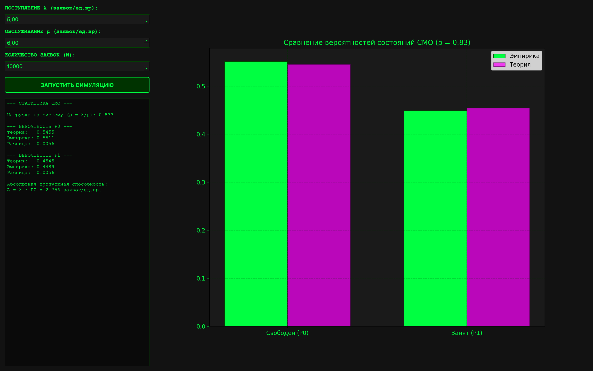

# Отчёт по лабораторной работе

## Система массового обслуживания M/M/1

### 1. Цель работы

Изучить свойства одноканальной системы массового обслуживания с отказами. Реализовать программное приложение для имитационного моделирования поступления и обслуживания заявок на сервере с графическим интерфейсом для:

1. Моделирования случайных интервалов времени поступления и обслуживания заявок на основе экспоненциального распределения.
2. Имитации логики обработки заявок: занятие свободного сервера или отказ при занятом сервере.
3. Построения эмпирических вероятностей состояний системы и их сопоставления с теоретическими.
4. Статистического анализа пропускной способности системы.

---

### 2. Описание приложения

#### 2.1. Модуль симуляции

Для генерации событий используется метод имитации временных интервалов. Время между поступлениями заявок и время их обслуживания независимы и распределены по экспоненциальному закону.

Программа рассчитывает абсолютное время поступления каждой заявки. При поступлении очередной заявки проверяется статус сервера:

* Если текущее время больше или равно времени освобождения сервера, заявка принимается к обслуживанию, а время освобождения сервера обновляется.
* Если сервер занят (заявка пришла раньше, чем сервер завершил предыдущую задачу), заявка получает отказ и покидает систему, так как очередь не предусмотрена.

#### 2.2. Система визуализации и аналитики

Интерфейс реализован на базе **PyQt6** с интеграцией **Matplotlib**. Он включает:

* **Конфигуратор параметров:** настройка интенсивности поступления $\lambda$ (заявки/ед.вр), интенсивности обслуживания $\mu$ (заявки/ед.вр) и количества испытаний $N$.
* **Графики:** отображает столбчатую диаграмму, сравнивающую эмпирические и теоретические вероятности простоя сервера ($P_0$) и отказов ($P_1$).
* **Статистика:** выводит рассчитанные значения вероятностей и абсолютной пропускной способности, что позволяет судить о качестве модели.

---

### 3. Математическая модель

#### 3.1. Генерация случайных величин

Для моделирования времени между поступлениями $\Delta t_{arr}$ и времени обслуживания $\Delta t_{srv}$ используется метод обратной функции:

$$\Delta t_{arr} = \frac{-\ln(1 - U)}{\lambda}$$

$$\Delta t_{srv} = \frac{-\ln(1 - U)}{\mu}$$

где $U$ — случайная величина, равномерно распределенная на интервале $[0, 1]$.

#### 3.2. Теоретические вероятности состояний

Для одноканальной СМО с отказами основной характеристикой является приведенная интенсивность нагрузки $\rho$:

$$\rho = \frac{\lambda}{\mu}$$

Теоретические вероятности состояний системы вычисляются по следующим формулам:

* Вероятность того, что сервер свободен:

$$P_0 = \frac{1}{1 + \rho}$$

* Вероятность того, что сервер занят:

$$P_1 = \frac{\rho}{1 + \rho}$$

Абсолютная пропускная способность системы (количество успешно обработанных заявок в единицу времени) равна:

$$A = \lambda \cdot P_0$$

---

### 4. Графический интерфейс пользователя

Интерфейс выполнен в темной теме с использованием кастомных стилей.

**Рисунок 1** — Визуализация сравнения вероятностей состояний СМО ($\lambda=5.0$, $\mu=6.0$, $\rho \approx 0.83$)

---

### 5. Результаты моделирования

В качестве тестовых параметров использовались: $\lambda = 5.0$ заявок/ед.вр, $\mu = 6.0$ заявок/ед.вр.
Приведенная нагрузка $\rho = 5/6 \approx 0.833$.
Теоретические значения: $P_0 \approx 0.5454$, $P_1 \approx 0.4545$.

#### Сравнение характеристик при разном количестве заявок ($N$)

| Объем выборки ($N$) | Эмпирическое $P_0$ | Эмпирическое $P_1$ | Отклонение $\Delta P_1$ |
| --- | --- | --- | --- |
| 100 | 0.5100 | 0.4900 | ~0.0355 |
| 1 000 | 0.5520 | 0.4480 | ~0.0065 |
| 10 000 | 0.5431 | 0.4569 | ~0.0024 |
| 100 000 | 0.5451 | 0.4549 | ~0.0004 |

---

### 6. Выводы

1. **Подтверждение теории:** В ходе имитационного моделирования подтверждена корректность применения формул Эрланга для систем с отказами. Доля потерянных заявок ($P_1$) и доля успешных обслуживаний ($P_0$) на практике стремятся к расчетным теоретическим значениям.
2. **Логика системы без очереди:** Эмпирические результаты доказывают, что отсутствие очереди приводит к прямой зависимости количества отказов от плотности поступающего потока и скорости работы канала. При высокой нагрузке ($\rho \to \infty$) вероятность отказа $P_1 \to 1$.
3. **Зависимость точности:** Как и в предыдущей работе, установлено, что точность имитационной модели напрямую зависит от объема сгенерированной выборки $N$. При $N=100000$ относительная погрешность моделирования составила менее $0.1\%$, что согласуется с законом больших чисел.